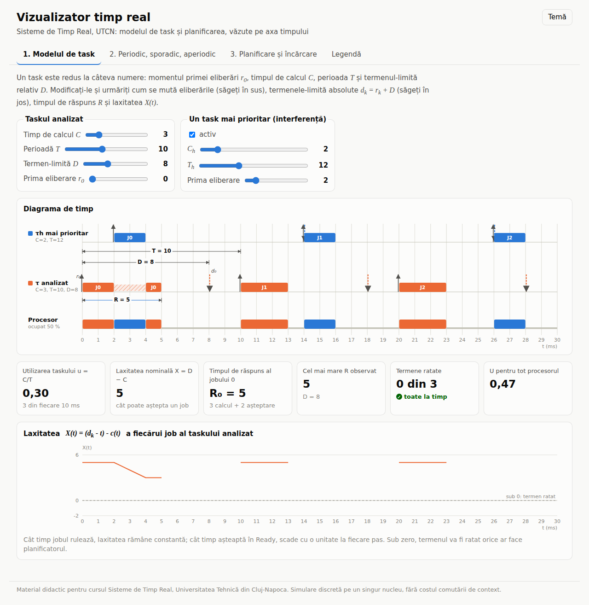
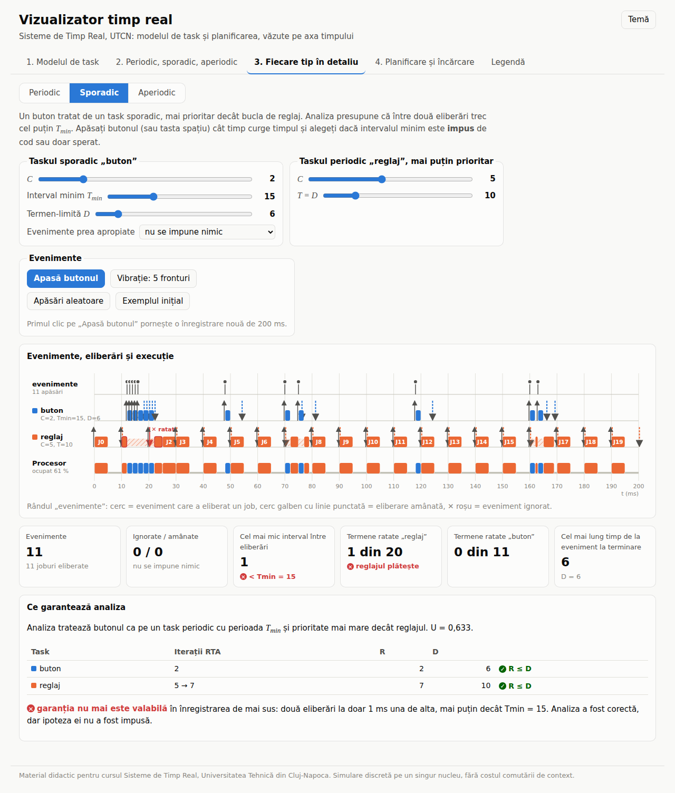
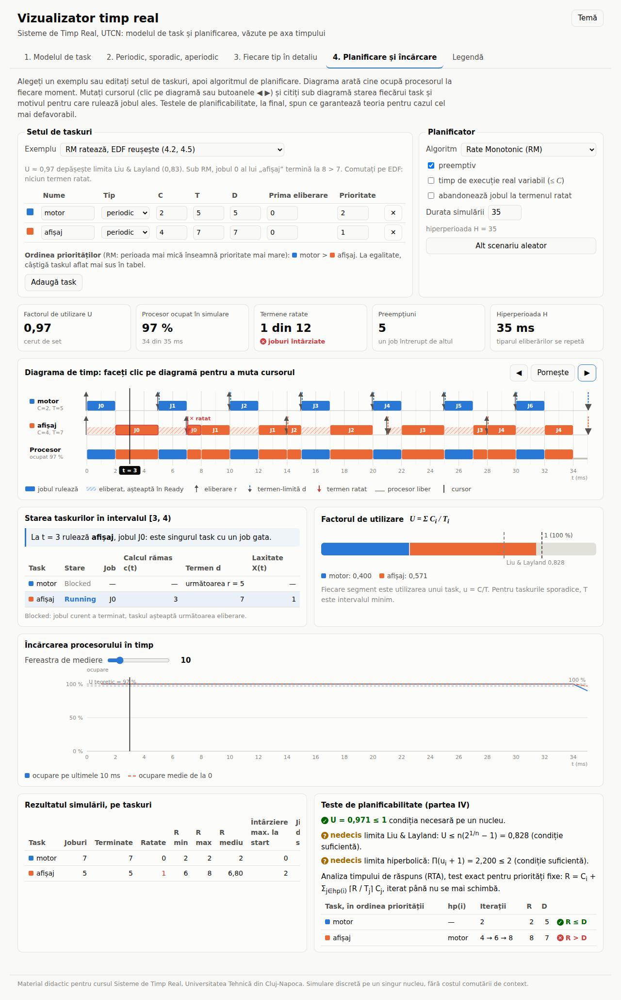
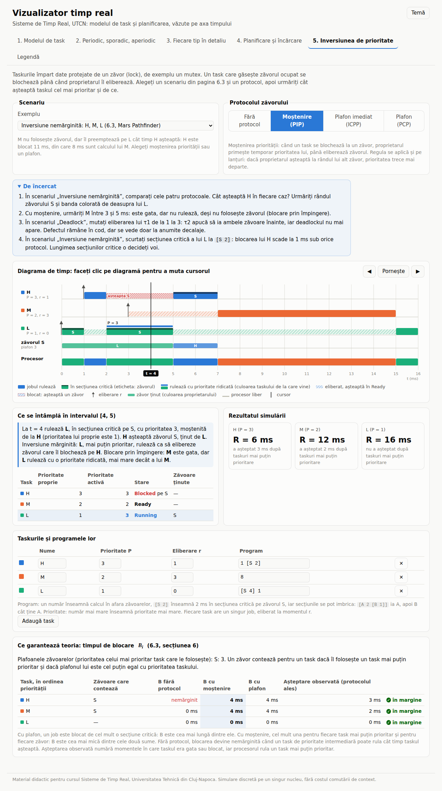

# Vizualizator timp real

*Real-Time Visualizer: interactive demos for the Real-Time Systems course (UTCN).
The page is available in Romanian and English; use the RO/EN button in the
header or open it with `?lang=en`.*

Demonstrații interactive pentru cursul **Sisteme de Timp Real** (UTCN). Studenții
modifică parametrii unui task sau ai unui set de taskuri și văd imediat, pe axa
timpului, eliberările, termenele-limită, execuția, timpul de răspuns, laxitatea
și încărcarea procesorului.

Aplicația este o pagină statică (HTML, CSS și JavaScript simplu, fără
dependențe și fără pas de compilare). Merge deschisă direct din fișier, de pe
GitHub Pages sau inclusă într-o pagină MkDocs.



## Ce conține

| Fila | Concepte | Pagini de curs |
|---|---|---|
| **1. Modelul de task** | $r_0$, $C$, $T$, $D$; eliberare $r_k$, termen absolut $d_k$, timp de răspuns $R$, laxitate $X(t)$; interferența unui task mai prioritar | 3.2 |
| **2. Periodic, sporadic, aperiodic** | același $C$ și $T$, trei feluri de eliberări; cererea de procesor cumulată; cea mai densă fereastră | 3.2 |
| **3. Fiecare tip în detaliu** | *Periodic*: așteptare absolută față de relativă pe aceleași $C_k$ și $\varepsilon_k$, deriva, $L_k$, jitter absolut și relativ, histogramă. *Sporadic*: apăsări de buton în timp real (clic sau tasta spațiu), intervalul minim impus (ignorare, amânare) sau doar sperat, efectul asupra unui task periodic mai puțin prioritar și asupra garanției RTA. *Aperiodic*: cereri servite cu prioritate maximă, în fundal sau de un server cu buget (cel mult $Q$ în orice fereastră de $T_s$, deci analizabil ca task periodic), cu graficul bugetului, RTA pentru periodice și încărcarea periodică reglabilă | 2.2, 2.3, 3.2, 4.8, 5.4 |
| **4. Planificare și încărcare** | editor de set de taskuri; RM, DM, priorități fixe manuale, EDF, LLF, FIFO; preemptiv sau nu; cursor pas cu pas cu stările Running / Ready / Blocked; factorul de utilizare, limita Liu & Layland, limita hiperbolică, RTA, testul EDF; încărcarea procesorului în timp | 3.3–3.4, 4.2–4.8 |
| **5. Inversiunea de prioritate** | taskuri cu programe scrise ca în curs (`1 [S 2]`, secțiuni imbricate `[A 2 [B 1]]`); fără protocol, moștenirea priorității (PIP), plafonul imediat (ICPP), protocolul plafonului (PCP); rânduri pentru fiecare zăvor, prioritatea moștenită marcată pe diagramă, explicația fiecărui moment, deadlock detectat; marginile $B_i$ față de blocarea observată. Scenarii: blocare mărginită, Mars Pathfinder, blocare în lanț, deadlock, prețul ICPP | 6.3, 6.4 |
| **Legendă** | cum se citește diagrama | — |

Fiecare vedere are o casetă „De încercat”, cu experimente scurte care pun în evidență conceptul, și o cheie a simbolurilor sub diagramă. În fila 4, sub diagramă, o frază explică de ce rulează jobul ales la momentul cursorului.

Fila 4 are exemple gata pregătite, legate de paginile cursului: setul
„senzor, comandă, jurnal”, instantul critic, „RM ratează, EDF reușește”,
termen constrâns (RM față de DM), RTA, supraîncărcare și efect de domino,
taskuri mixte, planificare nepreemptivă, EDF față de LLF.







## Limba: română și engleză

Butonul RO/EN din antet schimbă limba întregii pagini; alegerea se păstrează în
browser. Adresa poate impune limba, util pentru includerea în alte pagini:
`index.html?lang=en#res/pathfinder`.

- Textul fix al paginii rămâne în română în `index.html`. Fiecare element are o
  cheie, de exemplu `data-i18n="model.13"`, iar traducerea engleză este în
  `js/i18n.js`, la aceeași cheie. Testul `tests/i18n.test.js` eșuează dacă o
  cheie din pagină nu are text în engleză.
- Textul generat de cod se scrie în perechi, `L('text român', 'English text')`,
  ca ambele limbi să fie modificate împreună. În exemple (`js/presets.js`),
  titlurile, notele și numele taskurilor sunt perechi `{ ro, en }`.
- Termenii englezi sunt cei din FreeRTOS, Linux și literatură (release,
  deadline, response time, laxity, priority inheritance, ceiling). Numerele
  folosesc virgula zecimală în română și punctul în engleză.

## Rulare locală

```bash
python3 -m http.server 8000     # apoi http://localhost:8000
# sau deschideți direct index.html în browser
npm test                        # testele motorului de simulare (Node 18+)
```

## Legături directe și includere în curs

Adresa poate deschide direct o filă sau un exemplu:

```text
index.html#model
index.html#arrivals
index.html#types/periodic      (periodic, sporadic, aperiodic)
index.html#sched/rm-edf        (senzor, critic, rm-edf, dm, rta, overload, mixed, nonpreempt, llf)
index.html#res/pathfinder      (blocare, pathfinder, lant, deadlock, icpp)
```

Într-o pagină MkDocs a cursului, după publicarea pe GitHub Pages:

```html
<iframe src="https://automatica-cluj.github.io/rt-visualizer/#sched/rm-edf"
        width="100%" height="900" style="border:0"></iframe>
```

## Structură

```text
index.html          pagina, cu toate filele (textul fix, în română)
css/style.css       temă luminoasă și întunecată, paleta taskurilor
js/i18n.js          limba paginii și textul englez al elementelor din index.html
js/sim.js           motorul de simulare, fără DOM (eliberări, planificatoare, analiză)
js/render.js        diagrama de timp și graficele, în SVG
js/presets.js       exemplele din filele 4 și 5
js/app.js           legătura dintre controale și desene
tests/sim.test.js   verifică motorul pe exemplele din curs
tests/i18n.test.js  verifică traducerea: fiecare cheie din pagină are text în engleză
```

Pentru un exemplu nou, adăugați un obiect în `js/presets.js`. Modelul de
simulare: timp discret, un singur nucleu, fără costul comutării de context; la
aceeași prioritate câștigă taskul aflat mai sus în tabel. Taskurile sporadice
sunt eliberate uneori exact la intervalul minim, alteori mai târziu; cele
aperiodice au intervale exponențiale cu media $T$.

## Publicare

Fluxul `.github/workflows/pages.yml` rulează testele și publică site-ul pe
GitHub Pages la fiecare push pe `main`. În setările depozitului, la
*Pages*, sursa trebuie să fie „GitHub Actions”.
